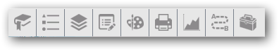
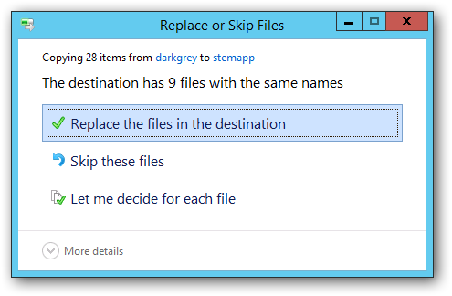

# Widget-Icons
Alternate icons for the Web AppBuilder for ArcGIS

The themes provided with the Web AppBuilder for ArcGIS all use white icons which look great on a dark background. 

But not so good on a light background.

This project provides darker icons appropriate for a lighter background.

## Installing the Icons
Each widget for Web AppBuilder stores its icon in the widgets\[WidgtName]\images\icon.png file. To change the icon, you can either:

* configure each widget and select a new icon
* use File Explorer to copy the icons and overwrite the existing icons.

The Widgets folder in the project contains the same structure as the widgets folder in the Web AppBuilder. To use File Explorer, copy the widgets folder from project and paste into the root of the 
widgets folder in the stemapp - for example, "C:\arcgis-web-appbuilder\client\stemapp\widgets". 
When prompted, choose to overwrite the files.

Copying the icons with File Explorer permanently replaces the white icons.

## FAQ
###I copied the icons using File Explorer, but they don't show up###
The icons in the stemapp folder are used when creating new sites. To apply to an existing site, copy the icons to the server\apps\[id]\widgets folder.

Also, empty your browser cache to be sure you're looking at the current versions of the image files.